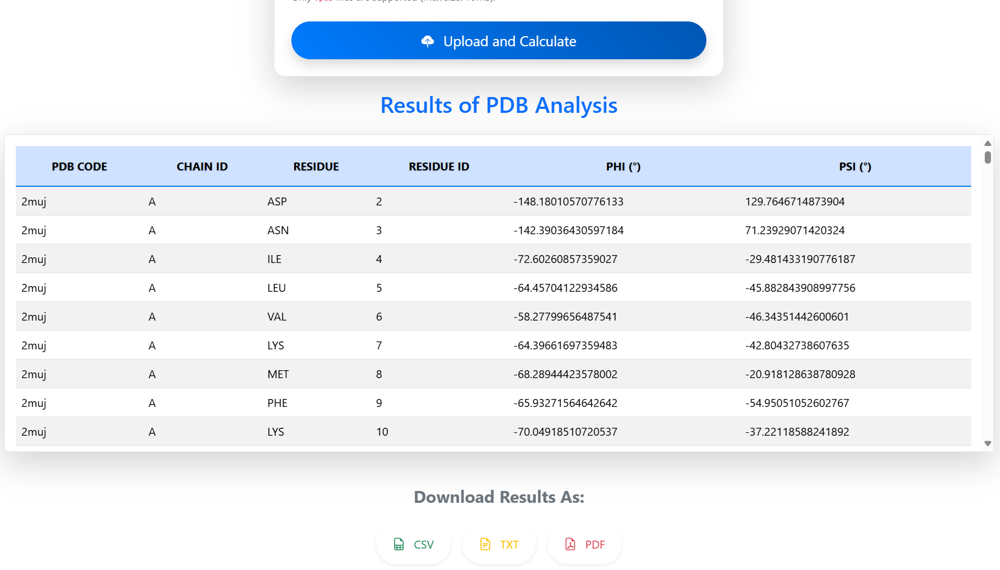

# Dihedral Angle Calculator from PDB(Protein Data Bank) file or PDB ID.


## Overview
The Dihedral Angle Calculator from PDB File is a web-based tool that calculates the Phi (Φ) and Psi (Ψ) dihedral angles for all residues in a protein structure provided in a .pdb file. The application allows users to view the results in a table and download them in various formats such as CSV, Excel, PDF, and TXT.

## Features
- Upload .pdb files or Enter PDB ID for processing.
- Calculate Phi and Psi angles for all residues in a protein.
- Display results in an interactive, scrollable table.
- Download results in multiple formats:
  - CSV
  - Excel
  - PDF
  - TXT
- Responsive and user-friendly design.
- Error handling for invalid file uploads and processing errors.

## Installation and Setup

### Clone the Repository
```bash
git clone https://github.com/your-username/pdb_angle_calc.git
cd pdb_angle_calc
```
## Install Dependencies
```bash
pip install -r requirements.txt
```
### Run the Application
```bash
python wsgi.py

```
### Access the Application
Open your browser and navigate to:
```bash
http://127.0.0.1:5000
https://pdb.indhinditech.com/
https://pdb-angle-calc.vercel.app
```
# Usage Guide

## File Upload
1. Click "Choose File" to select a .pdb file.
2. Click "Upload and Calculate" to process the file.

## Results Display
The results table shows the following details for each residue:
- **PDB Code**
- **Chain ID**
- **Residue Name**
- **Residue ID**
- **Phi (°)**
- **Psi (°)**

## Download Options
Use the download buttons to export results in your preferred format:
- **CSV**
- **Excel**
- **PDF**
- **TXT**

## File Structure
```bash
pdb_angle_calc/
│
├── app.py                # Backend logic
├── templates/
│   └── index.html        # Frontend template
├── static/
│   ├── css/
│   │   └── styles.css    # Application styles
│   ├── js/
│   │   └── scripts.js     # Client-side JavaScript
│   └── images/           # Placeholder for images (if needed)
├── requirements.txt      # Dependencies
└── README.md             # Documentation
```
## Result

